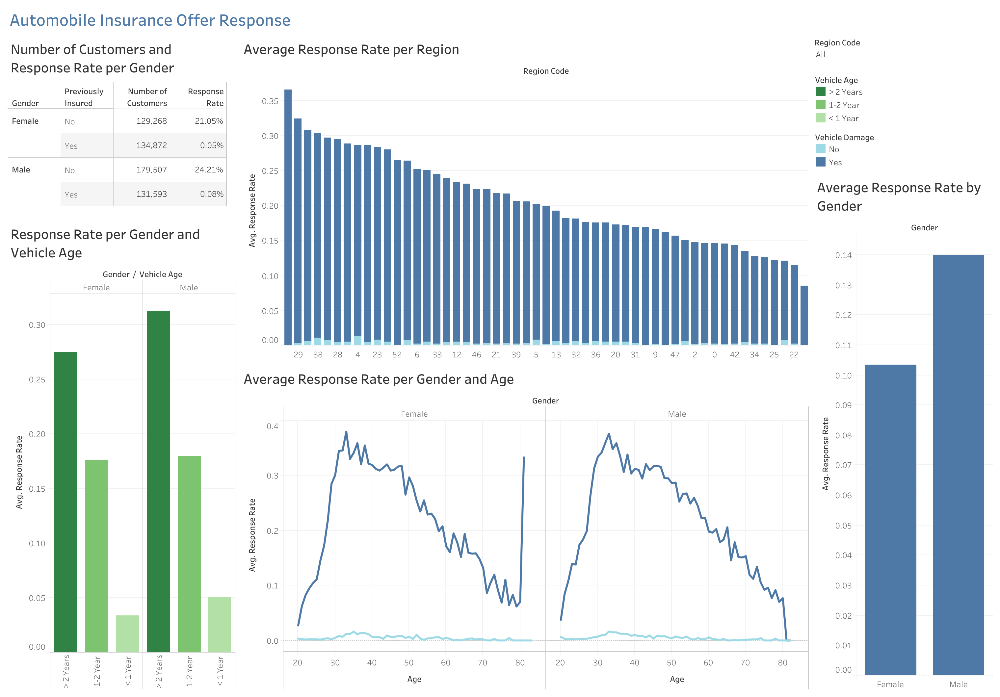

# Automobile Insurance Response Classifier
EDA and an Ensemble model comprised of XGBoost, CatBoost, LightBGM, and other algorithms to predict whether customers will respond positively to new automobile insurance offers based on demographic, engagement, and risk-related data. Submission as part of Kaggle competition.

Models were scored with ROC-AUC score, which measures how well a model is in classifying a binary outcome. A score of 0.5 indicates random guessing, and a score of 1 indicates perfect discrimination. 

Our model scored 0.8817 in the training set, and 0.88 in the testing set, and ultimately achieved 735th out of 2,425 participants (top 30%).

## Dataset Characterisitcs
The dataset used to train the Voting Classifier contained demographic data (like gender, age, and region of a customer) as well as other variables such as whether the customer had previously been insured. In total, there were over 11 million observations in the training dataset, and over 7 million observations for the testing dataset. A table schema is shown below.

## Insights Summary
*The following insights and the performance dashboard utilized a small sample from the original dataset.*

In order to evaluate how effective the insurance offer was among groups, we focused on the following metrics:

**Response Rate:** the proportion of customers who respond positively to the insurance offer.
- The overall average response rate for men was almost **4% higher** than that for women.
- Among those who were not previosly insured, more than **20%** responded positively to the insurance offer. On the other hand, almost **0% of those who were already insured approved the offer**.
- The positive response rate for those who had never had vehicle damage was **almost 0%**, regardless of age and gender.
- Those who had older vehicles (more than 2 years) had a positive response rate (27% for women, 31% for men) more than **10% higher** than the group with vehicles between 1-2 years of age. The group with vehicles less than one year old had the lowest positive response rate, at less than 5%.
- For both men and women, the group between **30-50 years of age** had the highest positive response rate, at around **30-35%**.

## Recommendations
- Tailor marketing campaigns and sales strategies for the groups with older vehicles, between 30-50 years of age, who have not been insured before, and who have had vehicle damage in the past, as these groups had the highest positive response rates.
- Investigate differences in the response to campaigns and insurance offers by gender, as it seems both men and women with the same demographics respond similarly, but a higher proportion of men respond positively to the offers for each group.

 ## Dashboard
The Tableau Public Dashboard can be found [here.](https://public.tableau.com/views/insurance_cross_selling/Dashboard1?:language=en-US&publish=yes&:sid=&:redirect=auth&:display_count=n&:origin=viz_share_link)

 ## Next Steps
 - Provide data on marketing and sales expenses to calculate the Customer Acquisition Cost.
 - Experiment with different marketing strategies, such as email and social media posts, and collect data on clicks and signups to calculate the Conversion Rate and the Click through Rate.
 - Improve the geographic data for the customers - such as with zipcodes and states - to further optimize marketing and sales strategies for customers in different regions.

## Files
- **eda.ipynb** contains all the data exploration for the training and testing dataset to verify integrity and quality, such as by checking for missing values and the distribution of the features in the training and testing set.
- **feature_engineering.ipynb** contains all the data preprocessing for the model, such as standardizing the numerical features and One-Hot encoding all categorical features. The preprocessed data is stored in the *scaled_data* folder.
- **tuning** is a folder with the hyperparameter tuning work for the XGBoost, CatBoost, Logistic Regression, and LightGBM models. Optuna was chosen to perform tuning.
- **insurance-cross-selling-comp.ipynb** is the final submission to the Kaggle competition.

## Data Source
Walter Reade, Ashley Chow. (2024). Binary Classification of Insurance Cross Selling . Kaggle. https://kaggle.com/competitions/playground-series-s4e7