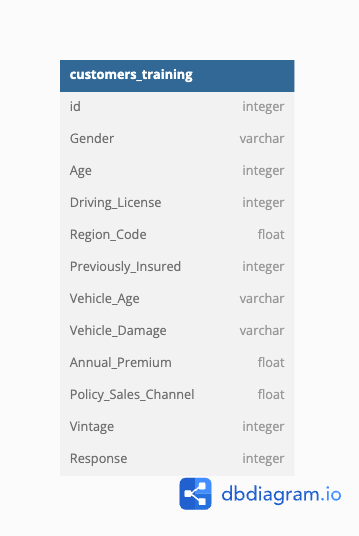

# Automobile Insurance Response Classifier
EDA and an Ensemble model comprised of XGBoost, CatBoost, LightBGM, and other algorithms to predict whether existing customers will respond positively to new insurance offers based on demographic data. Submission as part of Kaggle competition.

Achieved 735th out of 2,425 participants (top 30%).

# Dataset Characterisitcs
The dataset used to train the Voting Classifier contained demographic data (like gender, age, and region of a customer) as well as other variables such as whether the customer had previously been insured. In total, there were over 11 million observations in the training dataset, and over 7 million observations for the testing dataset. A table schema is shown below.

# Files
- **eda.ipynb** contains all the data exploration for the training and testing dataset to verify integrity and quality, such as by checking for missing values and the distribution of the features in the training and testing set.
- **feature_engineering.ipynb** contains all the data preprocessing for the model, such as standardizing the numerical features and One-Hot encoding all categorical features. The preprocessed data is stored in the *scaled_data* folder.
- **tuning** is a folder with the hyperparameter tuning work for the XGBoost, CatBoost, Logistic Regression, and LightGBM models. Optuna was chosen to perform tuning.
- **insurance-cross-selling-comp.ipynb** is the final submission to the Kaggle competition.

# Data Source
Walter Reade, Ashley Chow. (2024). Binary Classification of Insurance Cross Selling . Kaggle. https://kaggle.com/competitions/playground-series-s4e7